# Huawei & Kirin Universal Toolkit (v6.2.0 Free Edition)

[](https://www.python.org/)
[](https://wiki.qt.io/Qt_for_Python)
[]()
[-lightgrey.svg)]()
[]()

A premier, professional reverse engineering, flashing, and firmware servicing suite tailored specifically for **Huawei & Honor** devices and **HiSilicon Kirin System-on-Chips (SoCs)**, with dedicated low-level hardware implementations for **Kirin 710 / 710F (Hi6260)**.

---

## 🏛️ Tri-Tier Cyber-Engineering Architecture

To guarantee the highest standard of technical excellence, zero binary bloat, and **100% intellectual property & open-source compliance**, the toolkit is strictly separated into three architectural pillars:

```mermaid
graph TD
    Studio["⚡ Huawei & Kirin Universal Toolkit Studio (PySide6 / Qt6)"]
    
    Studio --> T1["🛡️ Tier 1: Native In-House Core"]
    Studio --> T2["🚀 Tier 2: Standalone GUI Companions (Zero-Hosting)"]
    Studio --> T3["⚡ Tier 3: Common CLI Utilities & Streaming Console"]

    T1 --> K710["Kirin 710 Fastboot RAM Register Hijack Engine"]
    T1 --> GPT["Live GPT / PTABLE Sector Resizer (GSI Prep)"]
    T1 --> OEM["OEMINFO Studio: Dual-SIM & Method 3 BL Unlock"]
    T1 --> NVE["NVE / NVME Calibration & Method 2 BL Unlock"]
    T1 --> EROFS["Pure-Python EROFS Unpacker / Repacker / Sparse Converter"]
    T1 --> SIGMA["SigmaKey & Factory Board Software Sequential Writer"]

    T2 --> KT["Kirin-Tool (Da-Niel): Testpoint, BL Unlock, Downgrade, Dumps, FRP"]
    T2 --> FF["FastbootFlasher (Natsume324): UPDATE.APP Extraction & Flashing"]
    T2 --> AU["Android Utility (mfl team): Universal Exploit & Recovery Servicing"]

    T3 --> CLI_OEM["huawei-oeminfo-tool CLI (ud3v0id)"]
    T3 --> DEV["Device Read Info (Fastboot getvar / ADB Properties)"]
    T3 --> DRV["Driver Studio: USB COM 1.0 (pnputil) & BCD Test Signing"]
    T3 --> FWD["Firmware Downloader: BD, Regular, Dumps, XML, Passwords & GSIs"]
    T3 --> TERM["Live Embedded Monospace Terminal (Non-Blocking Signals)"]
```



---

### 1. Tier 1: Native In-House Core (Proprietary Python Engines)
The core of this repository consists exclusively of original, in-house developed Python algorithms and research:
* **Kirin 710 Direct Fastboot Memory Write Bypass:** Utilizes direct Fastboot OEM memory primitives (`fastboot oem write@0x3C3E4ED8@0x3C001364`, `fastboot oem write@0x3C3EC1F0@0x3C001364`, `fastboot oem write@0x3C412344@0x00000001`) to suppress NVME write protection, certificate verification, and HDCP DRM bitmasks directly in volatile RAM without hardware testpoint disassembly.
* **GPT / PTABLE Resizer:** Live sector reallocation and partition table balancing using the `gdisk` engine to enlarge system, vendor, and product partitions for Treble Generic System Images (GSIs) without corrupting adjacent LBA offsets.
* **OEMINFO Studio:** Bit-level OEMINFO parsing, Dual-SIM conversions across synchronized regions, Method 3 bootloader unlock patching without wiping user data, and `SOFTWARE_VER_LIST.mbn` version tag injection for firmware downgrading.
* **NVE / NVME Calibration:** Direct hardware NVME block parsing, SN, IMEI, Wi-Fi/BT MAC modification, Method 2 bootloader unlock, FBLOCK state toggling, and automated CRC32 recalculation.
* **Pure-Python EROFS Studio:** Full-featured filesystem extraction, repacking, and sparse `<->` raw conversion implemented natively in Python.
* **Sigma & Board Software Partition Writer:** Sequential partition flasher supporting SigmaKey dumps (`.skd`), factory board packages, and IDT XML specifications with real-time progress tracking.

---

### 2. Tier 2: Standalone GUI Companions (Zero-Hosting Policy)
External applications that feature their own graphical interfaces are never bundled as third-party binaries or loaders within this repository:
* **Transparent Delegation:** When a companion tool is requested, the toolkit opens the official developer portal in your default web browser to credit and validate the creators.
* **Automated Direct Fetching:** Concurrently, the toolkit performs a background direct fetch of the official archive into `tools/<tool_id>/`, verifies extraction passwords (e.g. `mfdl` for Android Utility), detects the main executable, and provides a 1-click launch button.
* **Dedicated Companions & Specialized Tasks:**
  1. **Kirin-Tool** (by Da-Niel): Software & Hardware Testpoint Mode, Bootloader Unlocking, Enable Downgrade Mode, Partition Read & Write / Dump, Multi-Stage FRP Erase & Removal.
  2. **FastbootFlasher** (by Natsume324): Full firmware UPDATE.APP extraction, raw partition flashing, and custom recovery installation.
  3. **Android Utility / A-Utility** (by mfl team): MTK & Kirin hardware exploits, Testpoint BROM handshake, and universal partition servicing.

---

### 3. Tier 3: Common CLI Utilities & Embedded Streaming
Headless command-line engines and utility bridges running asynchronously in background `QThread` workers without freezing the graphical user interface:
* **huawei-oeminfo-tool** (by ud3v0id): Comprehensive block inspection, unpacking, and repacking with stdout streamed live into the embedded terminal.
* **Device Read Info:** Instant Fastboot `getvar all` variable parsing and ADB hardware identification.
* **Huawei USB Drivers Studio:** Automated Windows driver installation for HUAWEI USB COM 1.0 serial ports via `pnputil`, with BCD Test Signing toggles.
* **Firmware Downloader Hub:** Direct high-speed web links to official factory board software (BD), regular firmware releases, scatter dumps (HTF/XML/BAT), archive passwords, and Project Treble GSIs on SourceForge.
* **Live Embedded Terminal Console:** Dark slate monospace diagnostic terminal with real-time log streaming, copy, clear, and log export functions.

---

## 🛡️ 100% Intellectual Property & Open-Source Compliance

This project adheres to rigorous open-source compliance standards:
* **Zero Binary Bloat:** No proprietary, leaked, or unauthorized third-party binaries are hosted in this repository.
* **Pure In-House Algorithms:** All firmware patchers, EROFS parsers, and OEMINFO editors are written in pure Python.
* **Strict Attribution:** Every referenced project, developer, and license is prominently cited in the software interface and documentation.

---

## 📋 Feature Matrix

| Module / Feature | Technology | Operation Mode | In-House Core? |
| :--- | :--- | :--- | :---: |
| **Kirin 710 Write-Protection Bypass** | Fastboot OEM Write Primitives | Fastboot Mode | ✔ Yes |
| **PTABLE / GPT Partition Resizer** | LBA Sector Balancing / gdisk | Offline / Fastboot | ✔ Yes |
| **Dual-SIM Rebranding** | OEMINFO Byte Struct Patching | Offline Image | ✔ Yes |
| **Method 3 Bootloader Unlock** | OEMINFO NV Flag Injection | Offline / Fastboot | ✔ Yes |
| **Method 2 Bootloader Unlock** | NVME Calibration Patching | Offline / Fastboot | ✔ Yes |
| **FBLOCK Toggle & CRC Auto-Fix** | Checksum Recalculation | Offline / Fastboot | ✔ Yes |
| **EROFS Unpack / Repack / Sparse** | Pure Python EROFS Engine | Local Filesystem | ✔ Yes |
| **Sigma & Board Software Flasher** | Sequential Partition Pipeline | Fastboot Mode | ✔ Yes |
| **Official Fastboot Resolution** | HiSuite Official Binary Priority | System Subprocess | ✔ Yes |
| **Standalone Companion Launcher** | Zero-Hosting Direct Fetch | Isolated Process | External Launcher |
| **Firmware Downloader Hub** | QDesktopServices Web Portal | Browser Mirror | Native Integration |
| **Live Embedded Console** | Non-Blocking QThread & Signals | Real-Time UI | ✔ Yes |

---

## 🔧 Prerequisites & System Requirements

### Hardware & OS
* **Operating System:** Windows 10 or Windows 11 (64-bit).
* **Python Runtime:** Python 3.9, 3.10, 3.11, or 3.12+ (64-bit).
* **USB Driver:** HUAWEI USB COM 1.0 Driver (`VID_12D1&PID_3609`) for hardware testpoint servicing.
* **Fastboot Binary:** Official HiSuite Fastboot tools (installed at `C:\Program Files (x86)\HiSuite\hwtools`) or Android Platform Tools in system PATH.

---

## 📦 Installation & Setup

1. **Clone the repository:**
   ```powershell
   git clone https://github.com/FrgfA4ftfzTdfyyyr5f6tESD3/huawei_kirin_toolkit.git
   cd huawei_kirin_toolkit
   ```

2. **Create a virtual environment (optional but recommended):**
   ```powershell
   python -m venv venv
   .\venv\Scripts\Activate.ps1
   ```

3. **Install Python dependencies:**
   ```powershell
   pip install -r requirements.txt
   ```

4. **Launch the graphical studio:**
   ```powershell
   python gui.py
   ```

5. **Or run via Command Line Interface (CLI):**
   ```powershell
   python cli.py --help
   ```

---

## 🌟 Credits, References & Community Contributors

We express our sincere gratitude to the firmware researchers, reverse engineers, and developers who made this unified studio possible:

### Official XDA Contributors & Community Researchers
* **[AltairFR](https://xdaforums.com/m/altairfr.11572895/)**: Senior XDA member, Creator of AltairFR Project Treble GSI builds for Kirin devices, Custom Recoveries, and Huawei partition servicing utilities.
* **[IQINIX](https://xdaforums.com/m/iqinix.13248003/)**: Senior XDA member, Maintainer of the comprehensive Huawei & Honor factory board software (BD), raw scatter dump repository (HTF, XML, BAT), and firmware archive passwords.

### Referenced Open-Source Projects
* **[huawei-oeminfo-tool](https://github.com/ud3v0id/huawei-oeminfo-tool)** by *ud3v0id* (MIT License): OEMInfo parsing, unpacking, and repacking algorithms.
* **[KirinBootstrapper](https://github.com/mashed-potatoes/KirinBootstrapper)** by *mashed-potatoes* (GPLv3 License): Kirin USB Download Mode bootstrap sequences.
* **[HuaweiFirmwareExtractor](https://github.com/IgorEisberg/HuaweiFirmwareExtractor)** by *Igor Eisberg* (GPLv3 License): UPDATE.APP binary chunk extraction and CRC verification.
* **[FastbootFlasher](https://github.com/Natsume324/FastbootFlasher)** by *Natsume324* (GPLv3 License): Fastboot sequential flash automation.
* **[Kirin-Tool](https://kirintool.cfd/)** by *Da-Niel / NDXCode* (BSL 1.1 / GPLv3): Kirin SoC testpoint servicing and repair protocols.
* **[Android Utility](https://www.mfdl.io/)** by *mfl / AndroidUtility Team*: Universal partition servicing and recovery helpers.
* **[Huawei-Unlock-Tool](https://github.com/mashed-potatoes/Huawei-Unlock-Tool)** by *Huawei Unlock Team* (AGPLv3 / GPLv3): Hardware testpoint boot sequences.

---

## 📜 License & Intellectual Property Notice
The in-house core and graphical studio of **Huawei & Kirin Universal Toolkit** are released under the [MIT License](LICENSE). Third-party projects cited in Tier 2 and Tier 3 remain the exclusive intellectual property of their respective authors under their original licenses (GPLv3, AGPLv3, MIT, BSL 1.1).
