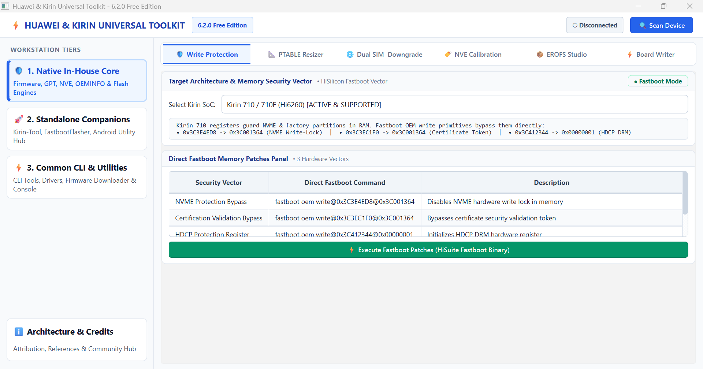

# Huawei & Kirin Universal Toolkit (v6.2.0 Free Edition)

[](https://www.python.org/)
[](https://wiki.qt.io/Qt_for_Python)
[]()
[-lightgrey.svg)]()
[]()

<p align="center">
  
</p>

A premier, professional reverse engineering, flashing, and firmware servicing suite tailored specifically for **Huawei & Honor** devices and **HiSilicon Kirin System-on-Chips (SoCs)**, with dedicated low-level hardware implementations for **Kirin 710 / 710F (Hi6260)**.

---

## 🏛️ Tri-Tier Cyber-Engineering Architecture

To guarantee the highest standard of technical excellence, zero binary bloat, and **100% intellectual property & open-source compliance**, the toolkit is strictly separated into three architectural pillars:

```mermaid
graph TD
    Studio["⚡ Huawei & Kirin Universal Toolkit Studio (PySide6 / Qt6)"]
    
    Studio --> T1["🛡️ Tier 1: Native In-House Core"]
    Studio --> T2["🚀 Tier 2: Standalone GUI Companions (Zero-Hosting)"]
    Studio --> T3["⚡ Tier 3: Common CLI Utilities & Streaming Console"]

    T1 --> K710["Kirin 710 Fastboot RAM Register Hijack Engine"]
    T1 --> GPT["Live GPT / PTABLE Sector Resizer (GSI Prep)"]
    T1 --> OEM["OEMINFO Studio: Dual-SIM & Method 3 BL Unlock"]
    T1 --> NVE["NVE / NVME Calibration & Method 2 BL Unlock"]
    T1 --> EROFS["Pure-Python EROFS Unpacker / Repacker / Sparse Converter"]
    T1 --> SIGMA["SigmaKey & Factory Board Software Sequential Writer"]

    T2 --> KT["Kirin-Tool (Da-Niel): Testpoint, BL Unlock, Downgrade, Dumps, FRP"]
    T2 --> FF["FastbootFlasher (Natsume324): UPDATE.APP Extraction & Flashing"]
    T2 --> AU["Android Utility (mfl team): Universal Exploit & Recovery Servicing"]

    T3 --> CLI_OEM["huawei-oeminfo-tool CLI (ud3v0id)"]
    T3 --> DEV["Device Read Info (Fastboot getvar / ADB Properties)"]
    T3 --> DRV["Driver Studio: USB COM 1.0 (pnputil) & BCD Test Signing"]
    T3 --> FWD["Firmware Downloader: BD, Regular, Dumps, XML, Passwords & GSIs"]
    T3 --> TERM["Live Embedded Monospace Terminal (Non-Blocking Signals)"]
```



---

### 1. Tier 1: Native In-House Core (Proprietary Python Engines)
The core of this repository consists exclusively of original, in-house developed Python algorithms and research:
* **Kirin 710 Direct Fastboot Memory Write Bypass:** Utilizes direct Fastboot OEM memory primitives (`fastboot oem write@0x3C3E4ED8@0x3C001364`, `fastboot oem write@0x3C3EC1F0@0x3C001364`, `fastboot oem write@0x3C412344@0x00000001`) to suppress NVME write protection, certificate verification, and HDCP DRM bitmasks directly in volatile RAM without hardware testpoint disassembly.
* **GPT / PTABLE Resizer:** Live sector reallocation and partition table balancing using the `gdisk` engine to enlarge system, vendor, and product partitions for Treble Generic System Images (GSIs) without corrupting adjacent LBA offsets.
* **OEMINFO Studio:** Bit-level OEMINFO parsing, Dual-SIM conversions across synchronized regions, Method 3 bootloader unlock patching without wiping user data, and `SOFTWARE_VER_LIST.mbn` version tag injection for firmware downgrading.
* **NVE / NVME Calibration:** Direct hardware NVME block parsing, SN, IMEI, Wi-Fi/BT MAC modification, Method 2 bootloader unlock, FBLOCK state toggling, and automated CRC32 recalculation.
* **Pure-Python EROFS Studio:** Full-featured filesystem extraction, repacking, and sparse `<->` raw conversion implemented natively in Python.
* **Sigma & Board Software Partition Writer:** Sequential partition flasher supporting SigmaKey dumps (`.skd`), factory board packages, and IDT XML specifications with real-time progress tracking.

---

### 2. Tier 2: Standalone GUI Companions (Zero-Hosting Policy)
External applications that feature their own graphical interfaces are never bundled as third-party binaries or loaders within this repository:
* **⭐ About & Download Portal:** Directly directs the user to the official developer website and repository releases in the default web browser.
* **📦 Import Downloaded Archive (.zip / .7z / .rar):** Seamless import and extraction engine supporting `.zip`, `.7z`, `.rar`, and `.tar` formats with automatic password handling (e.g. `mfdl` for Android Utility) and automatic `.exe` detection.
* **🚀 Launch Tool with UAC Elevation:** Automatic detection and elevation using Windows `ShellExecuteW` (`runas`) for tools that require administrative privileges (e.g. low-level USB drivers and filter drivers in Android Utility).
* **Dedicated Companions & Specialized Tasks:**
  1. **Kirin-Tool** (by Da-Niel): Software & Hardware Testpoint Mode, Bootloader Unlocking, Enable Downgrade Mode, Partition Read & Write / Dump, Multi-Stage FRP Erase & Removal.
  2. **FastbootFlasher** (by Natsume324): Full firmware UPDATE.APP extraction, raw partition flashing, and universal Fastboot servicing for all Huawei device models.
  3. **Android Utility / A-Utility** (by mfl team): Write files in Upgrade Mode (DLOAD / USB Upgrade), flash & update via USB cable in Recovery mode (eRecovery / USB Update), and MTK/Qualcomm universal servicing.

---

### 3. Tier 3: Common CLI Utilities & Embedded Streaming
Headless command-line engines and utility bridges running asynchronously in background `QThread` workers without freezing the graphical user interface:
* **huawei-oeminfo-tool** (by ud3v0id): Comprehensive block inspection, unpacking, and repacking with stdout streamed live into the embedded terminal.
* **Device Read Info:** Instant Fastboot `getvar all` variable parsing and ADB hardware identification.
* **Huawei USB Drivers Studio:** Automated Windows driver installation for HUAWEI USB COM 1.0 serial ports via `pnputil`, with BCD Test Signing toggles.
* **Firmware Downloader Hub:** Direct high-speed web links to official factory board software (BD), regular firmware releases, scatter dumps (HTF/XML/BAT), archive passwords, and Project Treble GSIs on SourceForge.
* **Live Embedded Terminal Console:** Dark slate monospace diagnostic terminal with real-time log streaming, copy, clear, and log export functions.

---

## 📱 Complete HiSilicon Kirin SoC & Device Matrix

The toolkit provides comprehensive multi-tier coverage for the entire lineage of Huawei HiSilicon Kirin SoCs, from early 28nm legacy platforms to cutting-edge 5nm architectures and Maleoon GPU platforms.

### 1. Legacy & Mid-Range Series (Hi62xx Architecture)

| Commercial SoC | Silicon Code | Process Node | Target OS / EMUI | Core Servicing Vectors & Capabilities | Typical Devices |
| :--- | :--- | :--- | :--- | :--- | :--- |
| **Kirin 620** | `Hi6210` | 28nm HPC | EMUI 3.x / 4.x | Fastboot Flash, Balong Bootloader Servicing, Factory Partition Recovery | P8 Lite (2015), Honor 4X, Honor 4C, G Play Mini |
| **Kirin 650**<br>**Kirin 655**<br>**Kirin 658**<br>**Kirin 659** | `Hi6250` | 16nm FinFET | EMUI 5.x / 8.0 / 8.2 | Full OEMINFO Unlock (Method 2/3), NVE Calibration, PTABLE Sector Resizing, Testpoint COM 1.0 (`VID_12D1&PID_3609`), Dual-SIM Rebranding | P9 Lite, P10 Lite, P20 Lite, P Smart (2018), Honor 6X / 7X / 8 Lite / 9 Lite, Mate 10 Lite, Nova 2 / 3e |
| **Kirin 710**<br>**Kirin 710F** | `Hi6260` | 12nm FinFET | EMUI 8.2 / 9.x / 10.x / 12.x | **In-House Direct Fastboot RAM Register Hijack** (`0x3C3E4ED8`, `0x3C3EC1F0`, `0x3C412344`), GSI GPT Resizer, DLOAD & eRecovery Flashing, Bootloader bypass without disassembly | P30 Lite, P Smart 2019 / 2020 / Z, Honor 8X / 9X Lite / 10 Lite / 20 Lite, Y9 2019 / Prime, Nova 3i |
| **Kirin 710A** | `Hi6260A` | SMIC 14nm FinFET | EMUI 10.x / 12.x / HarmonyOS 2.0 | OEMINFO Rebrand, Downgrade Vector Injection, Factory Board Software Flashing, Testpoint COM 1.0 Injection | P Smart 2021, Honor Play 4T, Y7a, Nova Y70 |

---

### 2. Upper Mid-Range & Performance Gaming Series (Hi6280 / Hi6290 Architecture)

| Commercial SoC | Silicon Code | NPU / Architecture | Target OS / HarmonyOS | Core Servicing Vectors & Capabilities | Typical Devices |
| :--- | :--- | :--- | :--- | :--- | :--- |
| **Kirin 810** | `Hi6280` | 7nm FinFET<br>DaVinci NPU (1x Ascend Lite) | EMUI 9.1 / 10.x / 11.x / HarmonyOS 2.0 | Testpoint Flashing, Native EROFS System Images Unpack/Repack, Fastboot OEM Partition Access, Board Software XML Writing | Nova 5 / 5z / 5i Pro, Honor 9X (China), Honor 20S, MatePad 10.4 |
| **Kirin 820 5G**<br>**Kirin 820E** | `Hi6290` | 7nm FinFET<br>Balong 5000 5G Modem | EMUI 10.1 / 11.x / HarmonyOS 2.0 | 5G Modem Partition Handling, Fastboot Servicing, EROFS Conversion, Custom Recovery Payload Flashing | Honor 30S, Honor X10 5G, Nova 7 SE 5G, Nova 8 SE Youth |

---

### 3. Classic Flagship Series (Hi36xx Architecture)

| Commercial SoC | Silicon Code | Process Node | Target OS / EMUI | Core Servicing Vectors & Capabilities | Typical Devices |
| :--- | :--- | :--- | :--- | :--- | :--- |
| **Kirin 910 / 920**<br>**Kirin 925 / 930 / 935** | `Hi3630`<br>`Hi3635` | 28nm HPM | EMUI 3.x / 4.x | IDT (Image Download Tool) Board Software Flashing, Direct xLoader Initial Boot Injection, Fastboot Flash Recovery | Ascend P7, Mate 7, Honor 6 / 6 Plus, P8, P8 Max, Honor 7 |
| **Kirin 950**<br>**Kirin 955** | `Hi3650` | 16nm FinFET+ | EMUI 4.x / 5.x | Fastboot Low-Level Commands, Partition Tables (PTABLE), OEMINFO Dual-SIM, SigmaKey Partition Dump Writing | Mate 8, P9, P9 Plus, Honor 8, Honor Note 8 |
| **Kirin 960** | `Hi3660` | 16nm FinFET+ | EMUI 5.x / 8.x / 9.x | Board Software xLoader Injection, NVE CRC Calibration, UFS 2.1 Dump Writing, Testpoint COM 1.0 Bootstrap | Mate 9, Mate 9 Pro, P10, P10 Plus, Honor 9, Honor 8 Pro (V9) |
| **Kirin 970** | `Hi3670` | 10nm FinFET (First NPU) | EMUI 8.x / 9.x / 10.x | NPU Baseline, Downgrade Proxy Integration, Factory Flashing, GPT Balancing, OEMINFO Rebrand & Unlock | Mate 10 / Pro, P20 / Pro, Honor 10, Honor View 10 (V10), Honor Play, Nova 3 |

---

### 4. Advanced Flagship & Modern 5G Series (Hi3680 / Hi3690 / Hi36A0 / Maleoon Platform)

| Commercial SoC | Silicon Code | Lithography | Target OS / HarmonyOS | Core Servicing Vectors & Capabilities | Typical Devices |
| :--- | :--- | :--- | :--- | :--- | :--- |
| **Kirin 980** | `Hi3680` | World's 1st 7nm<br>Dual-NPU DaVinci | EMUI 9.x / 10.x / 11.x / Magic UI 2.x - 4.x | Native EROFS Engine, GPT Resizing for Project Treble GSIs, Full UPDATE.APP Splitting, Board Software XML Servicing | Mate 20 / Pro / X / RS, P30 / P30 Pro, Honor 20 / Pro, Honor View 20, Magic 2, Nova 5T |
| **Kirin 985 5G** | `Hi3690` | 7nm FinFET<br>Dual NPU | EMUI 10.x / 11.x / HarmonyOS 2.0 | HiSuite Rollback Delivery, 5G Modem Calibrations, DLOAD / eRecovery Flashing Hub | Nova 7 5G, Nova 7 Pro 5G, Honor 30, Honor V6 Tablet |
| **Kirin 990 4G**<br>**Kirin 990 5G** | `Hi3690`<br>`Hi3690 5G` | 7nm / 7nm+ EUV<br>Balong 5000 | EMUI 10.x / 11.x / HarmonyOS 2.0 / 3.0 | UFS 3.0 Servicing, DLOAD & eRecovery Update Hub, Fastboot Flasher Integration, EROFS Repack | Mate 30 / Pro 4G/5G, P40 / Pro / Pro+, Nova 6 / 6 5G, Honor V30 / V30 Pro, MatePad Pro |
| **Kirin 9000**<br>**Kirin 9000E 5G** | `Hi36A0` | 5nm EUV<br>24-core Mali-G78 | EMUI 11.x / HarmonyOS 2.0 / 3.0 / 4.0 | UPDATE.APP Splitter, Board Writing, NVME Partition Parsing, High-Speed Raw Flasher | Mate 40 / Pro / Pro+ / RS, Mate X2, P50 Pro (Kirin), MatePad Pro 12.6 |
| **Kirin 9000S**<br>**Kirin 9010** | `Maleoon Platform` | Advanced 3D Multi-Die | HarmonyOS 4.0 / 4.2 / NEXT Ready | Firmware Downloader Hub Integration, XML & Dump Parsing, Diagnostic ADB/Fastboot Interrogation | Mate 60 / Pro / Pro+, Mate X5, Pura 70 / Pro / Ultra |

---

### 5. Huawei Qualcomm & MediaTek (MTK) Series

The toolkit provides extended ecosystem support for Huawei devices powered by non-Kirin platforms through seamless integration with Tier 2 standalone companion engines:

* **MediaTek (MTK) Platforms (`MT67xx` / `MT68xx`):** Direct BROM handshake, Upgrade Mode DLOAD writing, USB eRecovery cable transfers, and partition backup/restore (e.g. `MT6761`, `MT6768`, `MT6789`, `MT6895` on Huawei Y5, Y6, Enjoy, and Honor Play series) via **Android Utility (A-Utility)**.
* **Qualcomm Snapdragon Platforms:** Complete Fastboot flashing, XML board software deployment, and partition extraction (e.g. Snapdragon 680, 778G 4G, 888 4G, 8+ Gen 1 4G on Huawei P50, Nova 9/10/11, and Mate 50 series) via **FastbootFlasher** and **Huawei IDT**.

---

## 🌐 Firmware & Operating System Compatibility Matrix

The toolkit is engineered to service all major operating system generations released across the Huawei & Honor ecosystem:

```
┌──────────────────────────────────────────────────────────────────────────────────────────────────┐
│                                HSKT OS COMPATIBILITY LIFECYCLE                                   │
├──────────────────┬──────────────────┬──────────────────┬──────────────────┬──────────────────────┤
│    EMUI 3 - 5    │    EMUI 8 - 9    │   EMUI 10 - 12   │  HarmonyOS 2 - 4 │  Project Treble GSIs │
│  Android 4.4 - 7 │   Android 8 - 9  │  Android 10 - 12 │ Microkernel Core │    AOSP 11 - 14+     │
├──────────────────┼──────────────────┼──────────────────┼──────────────────┼──────────────────────┤
│ • Fastboot flash │ • Testpoint 1.0  │ • EROFS System   │ • Board software │ • PTABLE / GPT live  │
│ • IDT Board XML  │ • Kirin 710 RAM  │ • Downgrade MBN  │ • Super partition│   sector balancing   │
│ • Balong rescue  │ • OEMINFO unlock │ • HiSuite Proxy  │ • HOS dump tools │ • Dynamic system LBA │
│ • Dual-SIM patch │ • NVE calibrate  │ • DLOAD Recovery │ • Rollback hub   │ • Vendor / odm fix   │
└──────────────────┴──────────────────┴──────────────────┴──────────────────┴──────────────────────┘
```

| Operating System Family | Supported Versions | Platform Status | Servicing Capabilities & Tools |
| :--- | :--- | :--- | :--- |
| **Huawei EMUI** | `3.1` / `4.0` / `5.0` / `8.0` / `8.2`<br>`9.0` / `9.1` / `10.0` / `10.1` / `11.0` / `12.0` | 🟢 Full Support | Fastboot flashing, OEMINFO Dual-SIM conversion, Method 2 & 3 bootloader unlock, downgrade vectors, and EROFS unpacking/repacking. |
| **HarmonyOS (HOS)** | `2.0` / `3.0` / `4.0` / `4.2`<br>*(HarmonyOS NEXT Ready)* | 🟢 Full Support | Firmware Downloader Hub integration, factory board flasher, UFS partition dumps, and HiSuite Proxy custom rollback delivery. |
| **Honor Magic UI** | `2.0` / `2.1` / `3.0` / `3.1` / `4.0` / `4.2` | 🟢 Full Support | Fastboot flashing, Kirin 980 / 810 partition servicing, OEMINFO region modifications, and raw image dumps. |
| **Project Treble GSIs** | **AOSP 11 / 12 / 12.1 / 13 / 14 / 15** | 🟢 Optimized | **Native PTABLE / GPT Resizer Engine:** Balances and expands system, vendor, and product partition LBA sectors to fit modern GSI ROMs (Phh, AltairFR, LineageOS, Pixel Experience). |

---

## 🛡️ 100% Intellectual Property & Open-Source Compliance

This project adheres to rigorous open-source compliance standards:
* **Zero Binary Bloat:** No proprietary, leaked, or unauthorized third-party binaries are hosted in this repository.
* **Pure In-House Algorithms:** All firmware patchers, EROFS parsers, and OEMINFO editors are written in pure Python.
* **Strict Attribution:** Every referenced project, developer, and license is prominently cited in the software interface and documentation.

---

## 📋 Feature Matrix

| Module / Feature | Technology | Operation Mode | In-House Core? |
| :--- | :--- | :--- | :---: |
| **Kirin 710 Write-Protection Bypass** | Fastboot OEM Write Primitives | Fastboot Mode | ✔ Yes |
| **PTABLE / GPT Partition Resizer** | LBA Sector Balancing / gdisk | Offline / Fastboot | ✔ Yes |
| **Dual-SIM Rebranding** | OEMINFO Byte Struct Patching | Offline Image | ✔ Yes |
| **Method 3 Bootloader Unlock** | OEMINFO NV Flag Injection | Offline / Fastboot | ✔ Yes |
| **Method 2 Bootloader Unlock** | NVME Calibration Patching | Offline / Fastboot | ✔ Yes |
| **FBLOCK Toggle & CRC Auto-Fix** | Checksum Recalculation | Offline / Fastboot | ✔ Yes |
| **EROFS Unpack / Repack / Sparse** | Pure Python EROFS Engine | Local Filesystem | ✔ Yes |
| **Sigma & Board Software Flasher** | Sequential Partition Pipeline | Fastboot Mode | ✔ Yes |
| **Official Fastboot Resolution** | HiSuite Official Binary Priority | System Subprocess | ✔ Yes |
| **Standalone Companion Launcher** | Zero-Hosting Direct Fetch & UAC Elevation | Isolated Process | External Launcher |
| **Firmware Downloader Hub** | QDesktopServices Web Portal | Browser Mirror | Native Integration |
| **Live Embedded Console** | Non-Blocking QThread & Signals | Real-Time UI | ✔ Yes |

---

## 🔧 Prerequisites & System Requirements

### Hardware & OS
* **Operating System:** Windows 10 or Windows 11 (64-bit).
* **Python Runtime:** Python 3.9, 3.10, 3.11, 3.12, or 3.13+ (64-bit).
* **USB Driver:** HUAWEI USB COM 1.0 Driver (`VID_12D1&PID_3609`) for hardware testpoint servicing.
* **Fastboot Binary:** Official HiSuite Fastboot tools (installed at `C:\Program Files (x86)\HiSuite\hwtools`) or Android Platform Tools in system PATH.
* **Archiver Support (for Tier 2 Import):** 7-Zip (`7z.exe`) recommended for compressed archive extraction (`.7z`, `.rar`, `.zip`).

---

## 📦 Installation & Setup

1. **Clone the repository:**
   ```powershell
   git clone https://github.com/FrgfA4ftfzTdfyyyr5f6tESD3/huawei_kirin_toolkit.git
   cd huawei_kirin_toolkit
   ```

2. **Create a virtual environment (optional but recommended):**
   ```powershell
   python -m venv venv
   .\venv\Scripts\Activate.ps1
   ```

3. **Install Python dependencies:**
   ```powershell
   pip install -r requirements.txt
   ```

4. **Launch the graphical studio:**
   ```powershell
   python gui.py
   ```

5. **Or run via Command Line Interface (CLI):**
   ```powershell
   python cli.py --help
   ```

---

## 🌟 Credits, References & Community Contributors

We express our sincere gratitude to the firmware researchers, reverse engineers, and developers who made this unified studio possible:

### Official XDA Contributors & Community Researchers
* **[AltairFR](https://xdaforums.com/m/altairfr.11572895/)**: Senior XDA member, Creator of AltairFR Project Treble GSI builds for Kirin devices, Custom Recoveries, and Huawei partition servicing utilities.
* **[IQINIX](https://xdaforums.com/m/iqinix.13248003/)**: Senior XDA member, Maintainer of the comprehensive Huawei & Honor factory board software (BD), raw scatter dump repository (HTF, XML, BAT), and firmware archive passwords.

### Referenced Open-Source Projects
* **[huawei-oeminfo-tool](https://github.com/ud3v0id/huawei-oeminfo-tool)** by *ud3v0id* (MIT License): OEMInfo parsing, unpacking, and repacking algorithms.
* **[KirinBootstrapper](https://github.com/mashed-potatoes/KirinBootstrapper)** by *mashed-potatoes* (GPLv3 License): Kirin USB Download Mode bootstrap sequences.
* **[HuaweiFirmwareExtractor](https://github.com/IgorEisberg/HuaweiFirmwareExtractor)** by *Igor Eisberg* (GPLv3 License): UPDATE.APP binary chunk extraction and CRC verification.
* **[FastbootFlasher](https://github.com/Natsume324/FastbootFlasher)** by *Natsume324* (GPLv3 License): Fastboot sequential flash automation.
* **[Kirin-Tool](https://kirintool.cfd/)** by *Da-Niel / NDXCode* (BSL 1.1 / GPLv3): Kirin SoC testpoint servicing and repair protocols.
* **[Android Utility](https://www.mfdl.io/)** by *mfl / AndroidUtility Team*: Universal partition servicing and recovery helpers.
* **[Huawei-Unlock-Tool](https://github.com/mashed-potatoes/Huawei-Unlock-Tool)** by *Huawei Unlock Team* (AGPLv3 / GPLv3): Hardware testpoint boot sequences.

---

## 📜 License & Intellectual Property Notice
The in-house core and graphical studio of **Huawei & Kirin Universal Toolkit** are released under the [MIT License](LICENSE). Third-party projects cited in Tier 2 and Tier 3 remain the exclusive intellectual property of their respective authors under their original licenses (GPLv3, AGPLv3, MIT, BSL 1.1).
